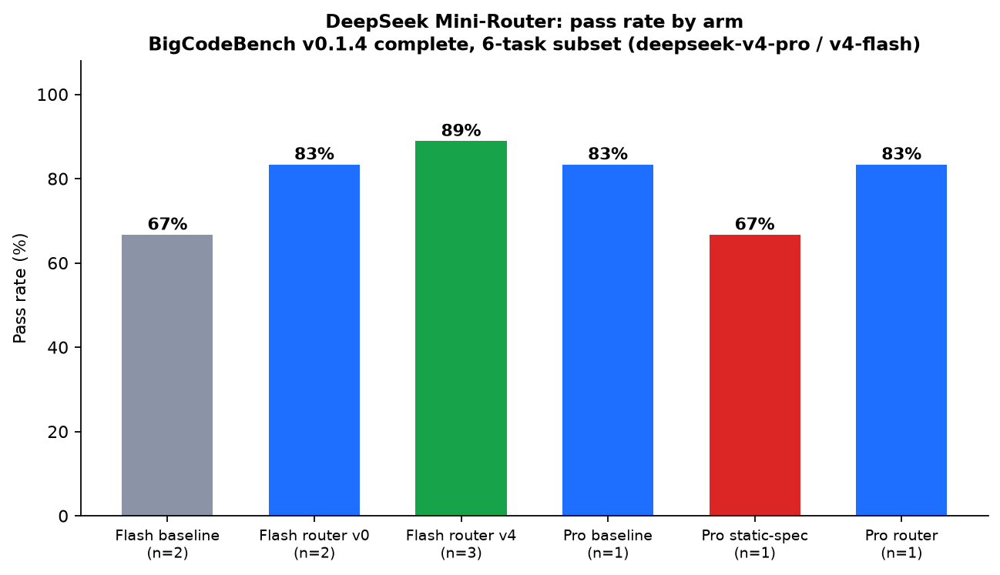
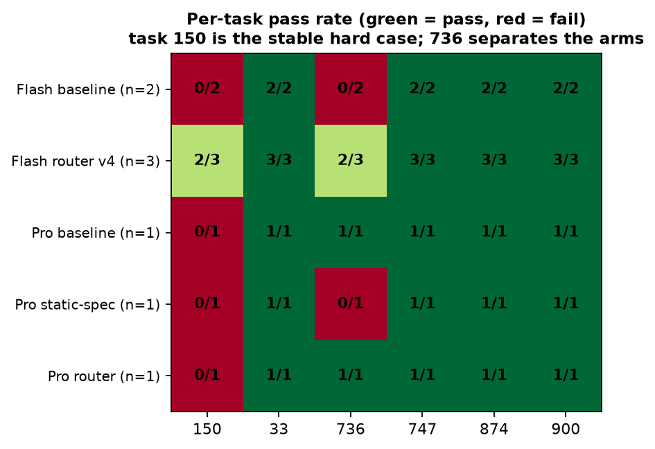
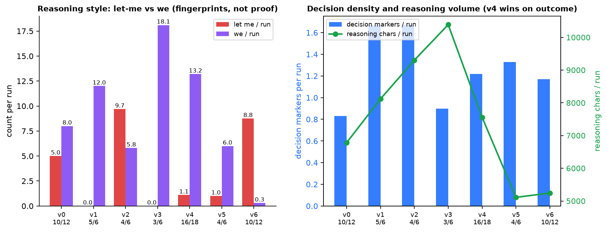

# DeepSeek Mini-Router（Codex 插件）

[English](README.en.md) | **中文（默认）**

给 Codex 里的 DeepSeek 模型（`deepseek-v4-pro` / `deepseek-v4-flash`）注入
「任务感知工作契约」的插件：按任务分类、会话内锁定模式，并通过钩子注入匹配
的 persona；桌面应用钩子不可用时由内置技能兜底，会话会主动说明当前走哪条通道。

**适用对象**：在 Codex（桌面或 CLI，官方 Responses API）里使用 DeepSeek 的人；
希望 Pro 在维护任务上先读后改、在新建任务上先产出再验证，希望 Flash 稳定
「决策 + 验证」而不是长篇自说自话。

在 6 任务 BigCodeBench 子集（`deepseek-v4-flash`）上的实测：
**基线 8/12 → 路由 v0 10/12 → 路由 v4「decide & verify」16/18**。
完整方法、逐题矩阵与诚实边界见 [docs/evidence.md](docs/evidence.md)；
可复现跑批见 [bench/](bench/README.md)。

## 快速开始

```sh
git clone https://github.com/hccccc01333/codex-deepseek-mini-router
cd codex-deepseek-mini-router
codex plugin marketplace add .
codex plugin add deepseek-minimal-anchor@codex-deepseek-mini-router
```

然后：

1. 信任钩子一次（应用插件设置或 CLI 的 `/hooks`）；信任按哈希绑定，插件更新后
   需重新信任并开新线程。
2. 新线程 + DeepSeek 模型，契约自动生效。
3. 随时问「mini-router 生效了吗」，助手会读审计日志回答
   （`~/.codex/deepseek-minimal-anchor-reports/hook-log.jsonl`）。

环境变量：

- `DEEPSEEK_MINIMAL_ANCHOR=always|never` —— 强制 / 禁用
- `DEEPSEEK_MINIMAL_ANCHOR_MODE=auto|spec|react|flash` —— 手动路由

## 工作模式

| 模式 | 谁触发 | 契约 |
| --- | --- | --- |
| spec | Pro + 维护/修复任务 | 先读文件、复现失败、计划最小改动，再动手 |
| react | Pro + 新建/构建任务 | 直接产出可运行结果，再用检查验证 |
| flash | `deepseek-v4-flash`（自动） | **决策 + 验证**：一步定任务类型、每个推理块以决策或信息需求收尾、写码后跑具体检查、失败重试一次 |

模式会话内锁定，绝不中途翻转；每轮按任务复杂度注入引导（复杂任务附加
「决策闭环」深锚）。双通道交付：**钩子**是主通道（桌面 + CLI），把契约作为
developer 上下文注入；**技能**是兜底通道，携带同一份契约并主动说明当前走哪条
通道。上下文压缩（compact）后会自动重新锚定契约，防止 persona 中途退化。
每次注入都写入审计日志。

## 「v4」到底是什么（命名对照）

README 里有两个容易混淆的编号：

- **插件版本**：v1 = 静态 minimal 锚定 → **v2 = 迷你路由（当前）**，这是插件代际；
- **Persona 变体**：v0–v6 是 Flash 工作契约的内部筛选编号，**不是插件版本**。

| Persona 变体 | Flash 契约 | 成绩（BigCodeBench 6 任务） |
| --- | --- | --- |
| v0 | 五锚（社区 w7 一脉） | 10/12（n=2） |
| v1 | 先复现 | 5/6（n=1） |
| v2 | 规格转代码 | 4/6（n=1） |
| v3 | 快速收敛 | 3/6（n=1） |
| **v4** | **决策 + 验证（当前默认）** | **16/18（n=3）** |
| v5 | 验证优先 | 4/6（n=1） |
| v6 | 决断第一人称（I need / I will） | 10/12（n=2） |

所以「router v4」= **persona 变体 4（决策 + 验证）**，不是插件 4.0。v4 是唯一
超过 v0 的变体；v6 与 v0 持平，但优势在小样本上是任务级噪声（详见
[docs/evidence.md](docs/evidence.md)）。

## 实测证据（可复现）







核心数字（BigCodeBench v0.1.4，6 任务子集，本地评分）：

| 臂 | 通过率 |
| --- | --- |
| Flash 基线（无插件，n=2） | 8/12（67%） |
| Flash v0 五锚（n=2） | 10/12（83%） |
| Flash v4 决策+验证（n=3） | **16/18（89%）** |
| Pro 基线（n=1） | 5/6（83%） |
| Pro 强制 spec（n=1） | 4/6（67%） |
| Pro 路由（n=1） | 5/6（83%） |

7 个 persona 变体筛选中，v4（决策 + 验证）是唯一超过 v0 的；思考链内容可从会话
transcript 的 `reasoning_text` 提取并打分。

诚实边界：样本小（n=1–3）、只测了「按规格实现」的 react 侧（spec 维护侧尚未
在 Codex 里测）；措辞（I need vs let me）只换失败题不换总分；本项目不背书
「超过 Opus 4.8」类第三方说法。完整方法见 [docs/evidence.md](docs/evidence.md)，
跑批见 [bench/](bench/README.md)。

## 开发 / 授权

```sh
cd plugins/deepseek-minimal-anchor
npm test            # 14 个单测 + 钩子测试
```

跑批复现：见 [bench/README.md](bench/README.md)；图表：
`python bench/make-charts.py`。MIT 许可（[LICENSE](LICENSE)），设计参考
dsh-router-standard、dsh-anchored-standard、modeltest（详见
[NOTICE.md](plugins/deepseek-minimal-anchor/NOTICE.md)）。社区项目，
与 DeepSeek、OpenAI 无隶属关系。

官方 Plugins Directory 提交素材与自检清单：
[docs/publish-checklist.md](docs/publish-checklist.md)。
